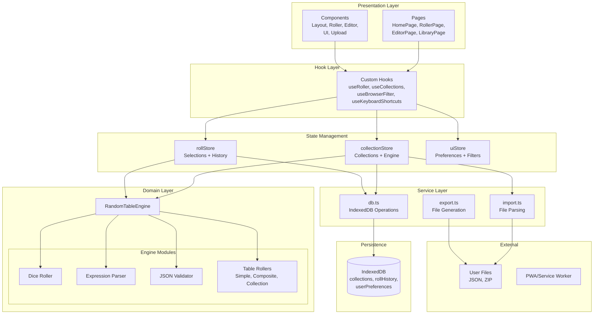
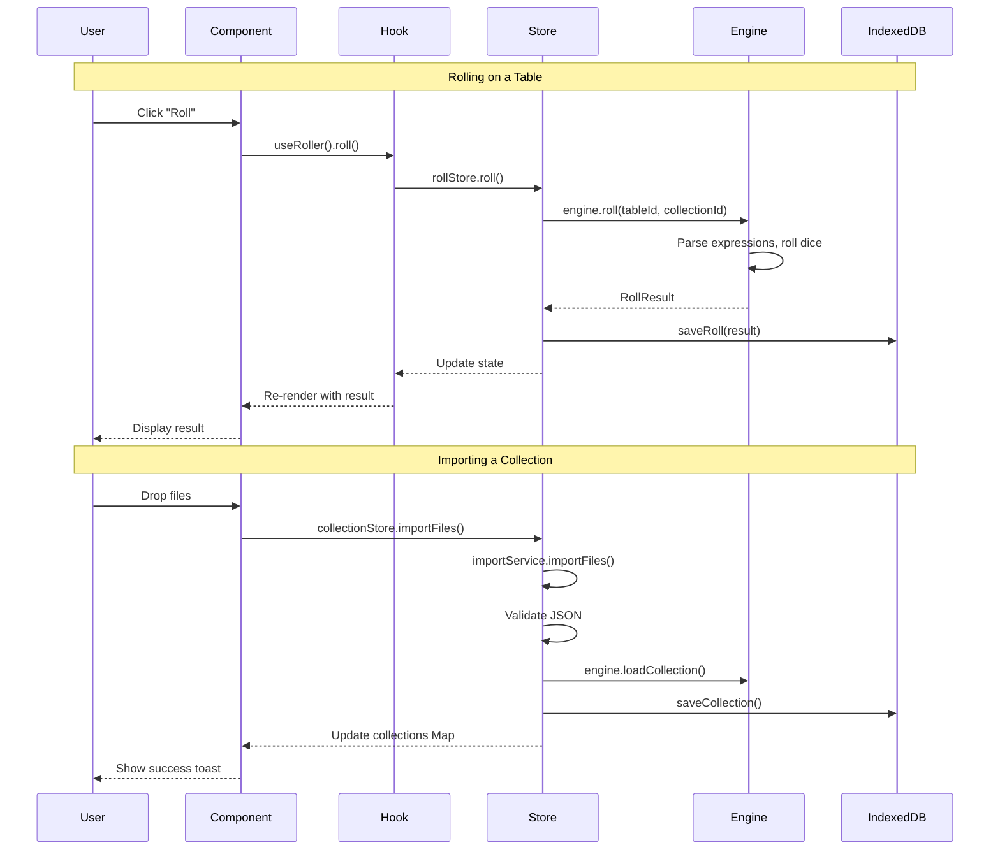
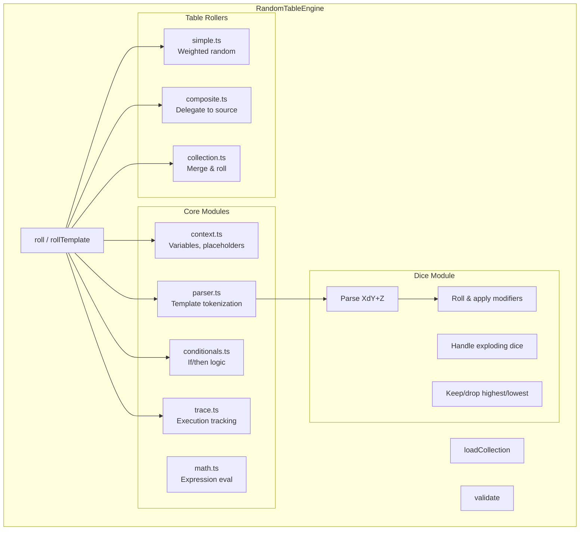
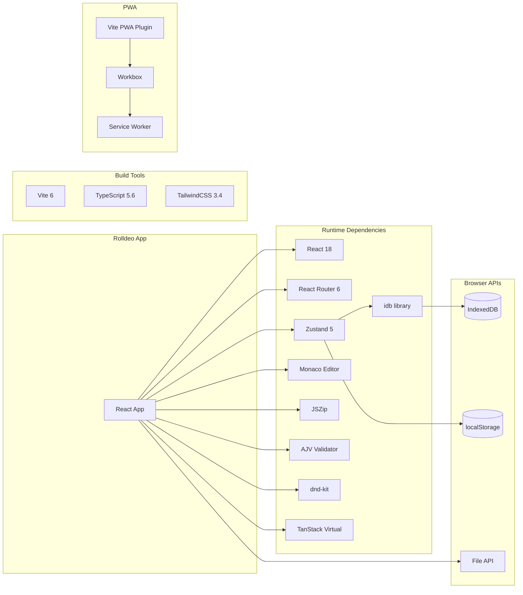

# Rolldeo Architecture

## Architectural Pattern Analysis

### Primary Pattern: **Layered Architecture with Flux-like State Management**

Rolldeo follows a **clean layered architecture** combined with a **Flux/Redux-like unidirectional data flow** pattern. The layers are well-defined with clear separation of concerns:

```
┌─────────────────────────────────────────────────────────────────────────┐
│                         PRESENTATION LAYER                               │
│  (React Components: Pages, UI Components, Layout)                        │
└────────────────────────────────┬────────────────────────────────────────┘
                                 │
                                 ▼
┌─────────────────────────────────────────────────────────────────────────┐
│                          HOOK LAYER                                      │
│  (Custom React Hooks: useRoller, useCollections, useBrowserFilter)       │
└────────────────────────────────┬────────────────────────────────────────┘
                                 │
                                 ▼
┌─────────────────────────────────────────────────────────────────────────┐
│                     STATE MANAGEMENT LAYER                               │
│  (Zustand Stores: collectionStore, rollStore, uiStore)                   │
└───────────────────┬─────────────────────────────┬───────────────────────┘
                    │                             │
                    ▼                             ▼
┌───────────────────────────────────┐  ┌─────────────────────────────────┐
│         DOMAIN/ENGINE LAYER       │  │       SERVICE LAYER             │
│  (RandomTableEngine, Dice,        │  │  (db.ts, import.ts, export.ts)  │
│   Tables, Parser, Validator)      │  │                                 │
└───────────────────────────────────┘  └─────────────────────────────────┘
                                                  │
                                                  ▼
                                       ┌─────────────────────────────────┐
                                       │      PERSISTENCE LAYER          │
                                       │  (IndexedDB via idb library)    │
                                       └─────────────────────────────────┘
```

---

## High-Level Architecture Diagram (Mermaid)



---

## Component Dependency Diagram

```mermaid
graph LR
    subgraph "Entry Point"
        main[main.tsx]
    end

    subgraph "Providers"
        EB[ErrorBoundary]
        TP[ToastProvider]
        AI[AppInitializer]
        RP[RouterProvider]
    end

    subgraph "Layout"
        Layout[Layout.tsx]
    end

    subgraph "Pages"
        HP[HomePage]
        RP2[RollerPage]
        EP[EditorPage]
        LP[LibraryPage]
        GP[GuidePage]
    end

    subgraph "Feature Components"
        Roller[/roller/*]
        Editor[/editor/*]
        Guide[/guide/*]
        Upload[/upload/*]
    end

    main --> EB --> TP --> AI
    TP --> RP
    RP --> Layout
    Layout --> HP & RP2 & EP & LP & GP

    RP2 --> Roller
    EP --> Editor
    GP --> Guide
    HP --> Upload
```

---

## Data Flow Diagram



---

## State Store Architecture

```mermaid
graph TB
    subgraph "collectionStore"
        CS_State[State]
        CS_Actions[Actions]
        CS_Selectors[Selectors]

        CS_State --> |engine| Engine[RandomTableEngine]
        CS_State --> |collections| CollMap[Map&lt;id, CollectionMeta&gt;]
        CS_State --> |isInitialized| Bool1[boolean]
        CS_State --> |isLoading| Bool2[boolean]

        CS_Actions --> |initialize| Init[Load from DB]
        CS_Actions --> |loadCollection| Load[Into engine + state]
        CS_Actions --> |saveCollection| Save[To DB + engine]
        CS_Actions --> |deleteCollection| Del[From DB + engine]
        CS_Actions --> |importFiles| Imp[Parse + validate]
    end

    subgraph "rollStore"
        RS_State[State]
        RS_Actions[Actions]

        RS_State --> |selectedCollectionId| Sel1[string | null]
        RS_State --> |selectedTableId| Sel2[string | null]
        RS_State --> |currentResult| Res[RollResult | null]
        RS_State --> |history| Hist[StoredRoll[]]

        RS_Actions --> |roll| Roll[Execute roll]
        RS_Actions --> |selectTable| SelT[Update selection]
        RS_Actions --> |loadHistory| LH[From IndexedDB]
    end

    subgraph "uiStore"
        UI_State[State]

        UI_State --> |searchQuery| SQ[string]
        UI_State --> |tagFilter| TF[string[]]
        UI_State --> |viewMode| VM[grid | list]
        UI_State --> |theme| TH[light | dark | system]
        UI_State --> |expandedCollections| EC[Set&lt;string&gt;]
    end
```

---

## Engine Internal Architecture



---

## Module Boundaries & Dependencies

```
┌──────────────────────────────────────────────────────────────────────────┐
│                              /src/pages/                                  │
│   Depends on: components/*, hooks/*, stores/* (via hooks)                │
│   Does NOT directly access: engine/*, services/*                          │
└──────────────────────────────────────────────────────────────────────────┘
                                    │
                                    ▼
┌──────────────────────────────────────────────────────────────────────────┐
│                            /src/components/                               │
│   Depends on: hooks/*, stores/* (selectively), lib/*                     │
│   Does NOT directly access: engine/*, services/*                          │
└──────────────────────────────────────────────────────────────────────────┘
                                    │
                                    ▼
┌──────────────────────────────────────────────────────────────────────────┐
│                              /src/hooks/                                  │
│   Depends on: stores/*                                                    │
│   Facade layer - composes multiple stores                                 │
└──────────────────────────────────────────────────────────────────────────┘
                                    │
                                    ▼
┌──────────────────────────────────────────────────────────────────────────┐
│                             /src/stores/                                  │
│   Depends on: engine/*, services/*                                        │
│   Acts as bridge between UI and business logic                            │
└──────────────────────────────────────────────────────────────────────────┘
                          │                    │
                          ▼                    ▼
┌─────────────────────────────────┐  ┌─────────────────────────────────────┐
│        /src/engine/             │  │         /src/services/              │
│   Pure business logic           │  │   I/O operations (DB, files)        │
│   No React dependencies         │  │   No React dependencies             │
│   Stateless operations          │  │   Async persistence                 │
└─────────────────────────────────┘  └─────────────────────────────────────┘
```

---

## External Dependencies & Integrations



---

## Consistency Assessment

### What's Done Well ✅

| Aspect | Assessment |
|--------|------------|
| **Layer Separation** | Excellent. Pages never directly access engine or services. |
| **Store Pattern** | Consistent Zustand usage across all three stores. |
| **Hook Abstraction** | Hooks properly compose stores, hiding complexity from components. |
| **Engine Isolation** | Engine has zero React dependencies - pure TypeScript. |
| **Service Layer** | Clean separation of DB and file I/O from business logic. |
| **Type Safety** | Comprehensive TypeScript interfaces throughout. |
| **Unidirectional Flow** | Data flows down, actions flow up - no prop drilling. |

### Minor Inconsistencies ⚠️

| Area | Observation |
|------|-------------|
| **Component Store Access** | Some components access stores directly (e.g., `useCollectionStore().engine`), bypassing hooks. This is acceptable for simple reads but could be standardized. |
| **Editor Components** | Editor components have more direct coupling to stores than Roller components, which use the `useRoller` facade more consistently. |
| **Service Calls** | Some store actions call services directly, others delegate. Consider extracting a "repository" pattern for consistency. |

### Recommendations

1. **Consider a `useEditor` hook** - Similar to `useRoller`, to provide a consistent facade for editor operations.
2. **Repository pattern** - Extract DB operations into repository classes for better testability.
3. **Engine singleton** - Currently stored in Zustand; could be a module-level singleton for simpler testing.

---

## ASCII Overview Diagram

```
                                    ┌─────────────────┐
                                    │   index.html    │
                                    └────────┬────────┘
                                             │
                                    ┌────────▼────────┐
                                    │    main.tsx     │
                                    │  (React Entry)  │
                                    └────────┬────────┘
                                             │
                    ┌────────────────────────┼────────────────────────┐
                    │                        │                        │
           ┌────────▼────────┐      ┌────────▼────────┐      ┌────────▼────────┐
           │  ErrorBoundary  │      │  ToastProvider  │      │ AppInitializer  │
           └─────────────────┘      └─────────────────┘      └────────┬────────┘
                                                                      │
                                                             ┌────────▼────────┐
                                                             │ RouterProvider  │
                                                             └────────┬────────┘
                                                                      │
                                                             ┌────────▼────────┐
                                                             │     Layout      │
                                                             │  (Header/Nav)   │
                                                             └────────┬────────┘
                                                                      │
                    ┌───────────────┬─────────────────┬───────────────┼───────────────┐
                    │               │                 │               │               │
           ┌────────▼────────┐ ┌────▼────┐ ┌─────────▼─────────┐ ┌────▼────┐ ┌────────▼────────┐
           │    HomePage     │ │ Library │ │    RollerPage     │ │  Editor │ │    GuidePage    │
           │                 │ │  Page   │ │                   │ │  Page   │ │                 │
           └────────┬────────┘ └────┬────┘ └─────────┬─────────┘ └────┬────┘ └─────────────────┘
                    │               │               │               │
                    └───────────────┴───────┬───────┴───────────────┘
                                            │
                               ┌────────────▼────────────┐
                               │      Custom Hooks       │
                               │ useRoller, useCollections│
                               └────────────┬────────────┘
                                            │
              ┌─────────────────────────────┼─────────────────────────────┐
              │                             │                             │
     ┌────────▼────────┐          ┌─────────▼─────────┐          ┌────────▼────────┐
     │ collectionStore │          │    rollStore      │          │    uiStore      │
     │                 │          │                   │          │                 │
     │ • engine        │          │ • selectedIds     │          │ • searchQuery   │
     │ • collections   │          │ • currentResult   │          │ • theme         │
     │ • load/save     │          │ • history         │          │ • filters       │
     └────────┬────────┘          └─────────┬─────────┘          └─────────────────┘
              │                             │
              │                             │
     ┌────────▼────────────────────────────▼────────┐
     │              RandomTableEngine               │
     │                                              │
     │  ┌──────────┐ ┌──────────┐ ┌──────────────┐  │
     │  │  Parser  │ │   Dice   │ │  Validator   │  │
     │  └──────────┘ └──────────┘ └──────────────┘  │
     │  ┌──────────┐ ┌──────────┐ ┌──────────────┐  │
     │  │  Simple  │ │Composite │ │  Collection  │  │
     │  │  Table   │ │  Table   │ │    Table     │  │
     │  └──────────┘ └──────────┘ └──────────────┘  │
     └──────────────────────────────────────────────┘
                           │
              ┌────────────┴────────────┐
              │                         │
     ┌────────▼────────┐       ┌────────▼────────┐
     │   services/db   │       │ services/import │
     │                 │       │ services/export │
     └────────┬────────┘       └─────────────────┘
              │
     ┌────────▼────────┐
     │    IndexedDB    │
     │                 │
     │ • collections   │
     │ • rollHistory   │
     │ • preferences   │
     └─────────────────┘
```

---

## Summary

**Pattern:** Layered Architecture + Flux-like State Management

**Layers (top to bottom):**
1. **Presentation** - React pages and components
2. **Hooks** - Composable logic facades
3. **State** - Zustand stores (single source of truth)
4. **Domain** - RandomTableEngine (pure business logic)
5. **Service** - I/O operations (DB, file handling)
6. **Persistence** - IndexedDB

**Consistency Score: 8.5/10**

The architecture is well-designed and consistently implemented. The separation between UI, state, and business logic is clean. The engine layer is particularly well-isolated with no framework dependencies. Minor improvements could be made in standardizing store access patterns and extracting a repository layer.
