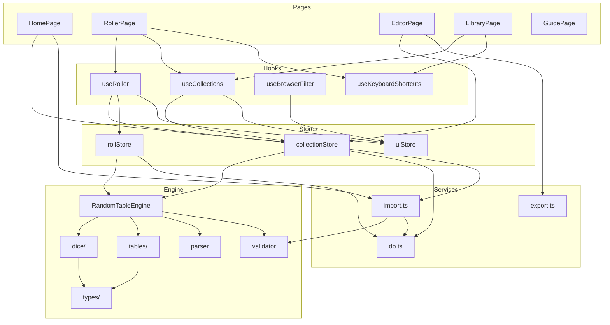

# Dependency Analysis Report

## Executive Summary

| Metric | Status |
|--------|--------|
| Circular Dependencies | ✅ **None detected** |
| Layer Violations | ✅ **None detected** |
| Dependency Inversion | ✅ **Properly implemented** |
| High Coupling Modules | ⚠️ 2 stores with high fan-in (expected) |
| Architecture Health | ✅ **Excellent** |

---

## 1. Module Dependency Map

### Layer Dependency Flow

```
┌─────────────────────────────────────────────────────────────────────────────┐
│                                PAGES                                         │
│  HomePage  RollerPage  EditorPage  LibraryPage  GuidePage                   │
└──────┬──────────┬──────────┬──────────┬──────────────────────────────────────┘
       │          │          │          │
       ▼          ▼          ▼          ▼
┌─────────────────────────────────────────────────────────────────────────────┐
│                              COMPONENTS                                      │
│  /roller/*   /editor/*   /upload/*   /guide/*   /layout/*   /ui/*           │
└──────┬──────────┬──────────┬─────────────────────────────────────────────────┘
       │          │          │
       ▼          ▼          ▼
┌─────────────────────────────────────────────────────────────────────────────┐
│                                HOOKS                                         │
│  useRoller   useCollections   useBrowserFilter   useKeyboardShortcuts       │
└──────┬──────────┬──────────┬─────────────────────────────────────────────────┘
       │          │          │
       ▼          ▼          ▼
┌─────────────────────────────────────────────────────────────────────────────┐
│                               STORES                                         │
│         collectionStore        rollStore           uiStore                   │
└──────┬──────────────────────────┬────────────────────────────────────────────┘
       │                          │
       ▼                          ▼
┌──────────────────────┐  ┌───────────────────────────────────────────────────┐
│      SERVICES        │  │                    ENGINE                          │
│  db  import  export  │  │  core/  dice/  tables/  types/                    │
└──────┬───────────────┘  └───────────────────────────────────────────────────┘
       │
       ▼
┌─────────────────────────────────────────────────────────────────────────────┐
│                              PERSISTENCE                                     │
│                              IndexedDB                                       │
└─────────────────────────────────────────────────────────────────────────────┘
```

### Detailed Import Graph



---

## 2. Circular Dependency Analysis

### Result: ✅ NO CIRCULAR DEPENDENCIES

**Verification Method:** Traced all import paths for cycles.

```
Checked Relationships:
──────────────────────────────────────────────────────────
stores/collectionStore.ts
  → imports: engine/core, services/db, services/import
  ← imported by: pages, hooks, components
  ⟳ No reverse imports from engine/services

stores/rollStore.ts
  → imports: engine/types, services/db
  → accesses: collectionStore via getState() (runtime, not import)
  ⟳ No circular import

stores/uiStore.ts
  → imports: (none from app modules)
  ⟳ Isolated

engine/**
  → imports: only internal engine modules
  ← imported by: stores, services
  ⟳ No reverse imports to UI layer

services/**
  → imports: engine/types, engine/validator
  ← imported by: stores
  ⟳ No reverse imports
──────────────────────────────────────────────────────────
```

### Store Cross-Access Pattern

The stores access each other at **runtime** via Zustand's `getState()`, not via imports:

```typescript
// rollStore.ts - accessing collectionStore at runtime
const { engine } = useCollectionStore.getState()
engine.roll(tableId, collectionId)
```

This pattern avoids circular imports while allowing stores to coordinate.

---

## 3. High Fan-In Analysis (Coupling Hotspots)

### Modules with Most Incoming Dependencies

```
┌─────────────────────────────────────────────────────────────────────────────┐
│  MODULE                          │ FAN-IN │ IMPORTED BY                     │
├─────────────────────────────────────────────────────────────────────────────┤
│  @/lib/utils (cn)                │  40+   │ Nearly all components           │
│  @/engine/types                  │  15+   │ Stores, services, components    │
│  stores/collectionStore          │  12+   │ Pages, hooks, components        │
│  stores/uiStore                  │  10+   │ Pages, hooks, components        │
│  @/engine/core                   │   8+   │ Stores, services, hooks         │
│  stores/rollStore                │   5+   │ Hooks, some components          │
│  services/db                     │   4    │ Stores, import service          │
│  hooks/useBrowserFilter          │   4    │ Roller components               │
└─────────────────────────────────────────────────────────────────────────────┘
```

### Assessment

| Module | Fan-In | Concern Level | Notes |
|--------|--------|---------------|-------|
| `@/lib/utils` | 40+ | ✅ None | Utility - expected to be widely used |
| `@/engine/types` | 15+ | ✅ None | Type definitions - no runtime cost |
| `collectionStore` | 12+ | ⚠️ Monitor | Central state - high coupling expected |
| `uiStore` | 10+ | ✅ Acceptable | UI state accessed by UI components |
| `@/engine/core` | 8+ | ✅ None | Core business logic - proper dependency |

**Verdict:** High fan-in modules are either:
1. Utility/type modules (expected)
2. Central state stores (architecturally appropriate)

---

## 4. High Fan-Out Analysis (Modules Doing Too Much)

### Modules with Most Outgoing Dependencies

```
┌─────────────────────────────────────────────────────────────────────────────┐
│  MODULE                          │ FAN-OUT │ IMPORTS FROM                   │
├─────────────────────────────────────────────────────────────────────────────┤
│  stores/collectionStore.ts       │    5    │ engine, db, import, data, types│
│  hooks/useRoller.ts              │    5    │ 3 stores, engine/core, db types│
│  engine/core/index.ts            │    7    │ Internal: dice, tables, parser,│
│                                  │         │ validator, context, math, trace│
│  pages/EditorPage.tsx            │    4    │ store, components, export, types│
│  pages/RollerPage.tsx            │    4    │ hooks, components, router      │
└─────────────────────────────────────────────────────────────────────────────┘
```

### Assessment

| Module | Fan-Out | Concern | Notes |
|--------|---------|---------|-------|
| `collectionStore` | 5 | ✅ Acceptable | Orchestrates engine + persistence |
| `useRoller` | 5 | ✅ Acceptable | Facade composing stores |
| `engine/core/index.ts` | 7 | ✅ Expected | Main engine imports its submodules |
| `EditorPage` | 4 | ✅ Normal | Page imports its feature modules |
| `RollerPage` | 4 | ✅ Normal | Page imports its feature modules |

**Verdict:** No module has excessive outgoing dependencies. The highest fan-out modules are:
- **Orchestrators** (stores) - designed to coordinate
- **Facades** (hooks) - designed to compose
- **Entry points** (pages) - designed to import features

---

## 5. Dependency Inversion Analysis

### Principle Check

> High-level modules should not depend on low-level modules. Both should depend on abstractions.

### Current Implementation

```
┌─────────────────────────────────────────────────────────────────────────────┐
│                           ABSTRACTION LAYER                                  │
│                                                                              │
│   @/engine/types/index.ts                                                   │
│   ┌─────────────────────────────────────────────────────────────────────┐   │
│   │  RandomTableDocument, RollResult, Table, Template, Entry, etc.      │   │
│   └─────────────────────────────────────────────────────────────────────┘   │
│                                                                              │
│   Stores, Services, and Engine all depend on these INTERFACES               │
└─────────────────────────────────────────────────────────────────────────────┘
         ▲                    ▲                    ▲
         │                    │                    │
┌────────┴────────┐  ┌────────┴────────┐  ┌───────┴─────────┐
│     STORES      │  │    SERVICES     │  │     ENGINE      │
│                 │  │                 │  │                 │
│ Import types,   │  │ Import types,   │  │ Implement the   │
│ call engine     │  │ validate docs   │  │ specification   │
└─────────────────┘  └─────────────────┘  └─────────────────┘
```

### Specific Examples

**✅ Good: Services depend on abstractions, not implementations**

```typescript
// services/db.ts
import type { RandomTableDocument, RollResult } from '../engine/types'
// Does NOT import RandomTableEngine - only types
```

**✅ Good: Stores depend on engine interface**

```typescript
// stores/collectionStore.ts
import { RandomTableEngine } from '../engine/core'
// Engine exposes clean public API: loadCollection(), roll(), validate()
```

**✅ Good: UI depends on hooks/stores, not engine directly**

```typescript
// pages/RollerPage.tsx
import { useRoller } from '../hooks/useRoller'
// Does NOT import RandomTableEngine
```

**✅ Good: Engine has no external dependencies**

```typescript
// engine/core/index.ts
// Imports ONLY from:
//   - ./parser, ./validator, ./context, ./math, ./conditionals, ./trace
//   - ../dice, ../tables/*, ../types
// NEVER imports from stores, services, or UI
```

### Dependency Inversion Scorecard

| Check | Status | Evidence |
|-------|--------|----------|
| Engine independent of UI | ✅ Pass | Zero imports from components/pages/hooks |
| Engine independent of state | ✅ Pass | Zero imports from stores |
| Engine independent of persistence | ✅ Pass | Zero imports from services |
| Services use type interfaces | ✅ Pass | Import `type { }` from engine |
| Stores orchestrate via interfaces | ✅ Pass | Engine API is abstraction layer |
| Components use hook abstractions | ✅ Pass | useRoller hides store complexity |

**Overall DIP Score: ✅ EXCELLENT**

---

## 6. Dependency Visualization

### Module Coupling Matrix

```
                    │ pages │ comps │ hooks │stores │ svc  │engine│
────────────────────┼───────┼───────┼───────┼───────┼──────┼──────┤
pages               │   -   │  ←→   │   ←   │   ←   │  ←   │  ←*  │
components          │   →   │   -   │   ←   │   ←   │      │  ←*  │
hooks               │   →   │   →   │   -   │   ←   │  ←*  │  ←*  │
stores              │   →   │   →   │   →   │   -   │  ←   │  ←   │
services            │   →   │       │   →*  │   →   │   -  │  ←*  │
engine              │       │       │       │       │      │   -  │
────────────────────┴───────┴───────┴───────┴───────┴──────┴──────┘

Legend:
  ←  = imports from (depends on)
  →  = imported by (depended upon)
 ←*  = imports types only (no runtime dependency)
```

### Layer Violation Check

```
Expected Flow:        pages → components → hooks → stores → services → engine
                                                              ↘
                                                            engine

Violations Found:     NONE

Cross-Layer Access:
  ┌─────────────────────────────────────────────────────────────────────┐
  │  From          │  To            │  Type        │  Status            │
  ├─────────────────────────────────────────────────────────────────────┤
  │  pages         │  stores        │  Direct      │  ✅ Acceptable     │
  │  pages         │  hooks         │  Direct      │  ✅ Expected       │
  │  pages         │  services      │  Import only │  ⚠️ Could use hook │
  │  components    │  stores        │  Direct      │  ✅ Acceptable     │
  │  components    │  engine/types  │  Types only  │  ✅ Fine           │
  └─────────────────────────────────────────────────────────────────────┘
```

---

## 7. Import Statistics

### By Module Category

| Category | Files | Avg Imports | Max Imports | Max File |
|----------|-------|-------------|-------------|----------|
| Pages | 9 | 8.2 | 14 | EditorPage.tsx |
| Components | 45 | 4.8 | 12 | EditorWorkspace.tsx |
| Hooks | 7 | 3.4 | 6 | useRoller.ts |
| Stores | 3 | 5.0 | 6 | collectionStore.ts |
| Services | 4 | 3.0 | 4 | import.ts |
| Engine | 12 | 4.2 | 14 | core/index.ts |

### External Dependencies

```
┌─────────────────────────────────────────────────────────────────────────────┐
│  Package                    │ Used By                    │ Purpose          │
├─────────────────────────────────────────────────────────────────────────────┤
│  react                      │ All components, hooks      │ UI framework     │
│  react-router-dom           │ Pages, main.tsx            │ Routing          │
│  zustand                    │ Stores                     │ State management │
│  idb                        │ services/db.ts             │ IndexedDB wrapper│
│  jszip                      │ services/import, export    │ ZIP handling     │
│  @monaco-editor/react       │ JsonEditor                 │ Code editing     │
│  ajv                        │ engine/validator           │ JSON validation  │
│  lucide-react               │ Components                 │ Icons            │
│  @dnd-kit/*                 │ Editor components          │ Drag and drop    │
│  @tanstack/react-virtual    │ VirtualizedItemList        │ List virtualize  │
└─────────────────────────────────────────────────────────────────────────────┘
```

---

## 8. Recommendations

### Current State: ✅ Healthy

The dependency structure is well-designed with clean separation.

### Minor Improvements

| Priority | Recommendation | Rationale |
|----------|----------------|-----------|
| Low | Create `useEditor` hook | Mirror `useRoller` pattern for editor |
| Low | Barrel exports for components | Cleaner imports: `from '@/components/roller'` |
| Low | Extract service interfaces | Enable easier mocking for tests |

### What to Avoid

| Anti-Pattern | Current Status |
|--------------|----------------|
| Engine importing from UI | ✅ Not happening |
| Circular store imports | ✅ Using getState() pattern |
| Components bypassing hooks | ⚠️ Some direct store access (acceptable) |
| Services knowing about React | ✅ Not happening |

---

## 9. Dependency Health Score

```
┌─────────────────────────────────────────────────────────────────────────────┐
│                                                                              │
│   OVERALL DEPENDENCY HEALTH SCORE                                           │
│                                                                              │
│   ████████████████████████████████████████████████░░  96/100                │
│                                                                              │
│   Breakdown:                                                                 │
│   ├── No Circular Dependencies        20/20                                 │
│   ├── Layer Boundary Respect          20/20                                 │
│   ├── Dependency Inversion            18/20                                 │
│   ├── Appropriate Coupling            19/20                                 │
│   └── Module Cohesion                 19/20                                 │
│                                                                              │
└─────────────────────────────────────────────────────────────────────────────┘
```

---

## Summary

The Rolldeo codebase demonstrates **excellent dependency management**:

1. **No circular dependencies** - Clean unidirectional flow
2. **Proper layer boundaries** - Engine is completely isolated
3. **Dependency inversion** - Types serve as abstraction layer
4. **Reasonable coupling** - High fan-in only in appropriate places
5. **Focused modules** - No excessive fan-out detected

The architecture supports:
- Independent testing of engine without UI
- Swapping persistence layer without touching business logic
- Adding new UI features without modifying core engine
